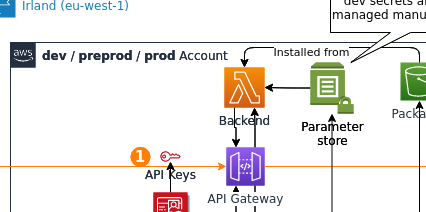
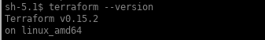
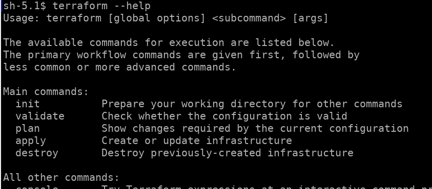

<!-- .slide: class="transition"-->  

# Découvrir Terraform

##==##
<!-- .slide: class="flex-row"-->

# Découvrir Terraform


Notes:
(vault)
Learn about secrets management and data protection.

(consul)
Learn how to run service discovery and a service mesh with Consul.

(terraform)
Learn about automated infrastructure provisioning.

(nomad)
Learn how to deploy and manage any containerized, legacy, or batch application.

(vagrant)
Learn to create development environments with Vagrant

(packer )
Learn to build automated machine images with Packer

##==##
<!-- .slide: -->

# Découvrir Terraform


<br/><br/><br/><br/>
Write, Plan, and Create Infrastructure as Code

Notes:
Infrastructure As Code :

L'infrastructure est décrite en texte

Terraform va convertir le texte en nombreux appels APIs vers la plateforme d’hébergement pour créer les “ressources” (serveurs, loadbalancers, règles firewalls, …)

##==##
<!-- .slide: -->

# Découvrir Terraform

## Principaux avantages de l’Infra As Code

* Le déploiement de l’infrastructure est automatisé :
  * le temps de déploiement est réduit
  * le risque d’erreur est réduit
  * un seul référentiel pour déployer de nombreux environnements
* Configuration management de l’infrastructure
  * imposer une configuration identique quelque soit l’environnement
  * mettre à jour massivement

##==##
<!-- .slide: -->

# Découvrir Terraform

## Principaux avantages de l’Infra As Code
* Adoption des bonnes pratiques liées au monde du développement
  * Versioning (réutilisation et partage du code, gestion des versions, traçabilité, suivi des incidents, revue de code et backup)
  * Documentation
  * Testing

Notes:
Source Code Management :

Re-usable : store on public hub, everyone can clone = easy to share !

Version control : See the diff !

Traceability : Who did this modification ?!

Backup : OMG I lost all of my changes...

Documentation : Le code est lisible et commenté

Testing : chaque ressource est testée et correspond au besoin fonctionnel

##==##
<!-- .slide: -->

# Découvrir Terraform

## Principaux avantages de l’Infra As Code

* “Do It Yourself”
  * l’utilisateur peut déployer des modèles déjà existants
  * les templates ont été validés et respectent bien l’urbanisation de l’entreprise

##==##
<!-- .slide:-->

# Découvrir Terraform


Notes:
Le développer a à sa disposition un ensemble de modules développés par les équipes d’infrastructure pour déployer ses environnements/applications tout en respectant les règles de sécurité et d’urbanisation

##==##
<!-- .slide: -->

# Terraform

## Produit Open-source


* https://github.com/hashicorp/terraform

  * 28k+ stars
  * 1500+ contributeurs

Notes:
Produit OpenSouce développé en Go

##==##
<!-- .slide: class="flex-row"-->

# Terraform
<br>
Workflow agnostique != Cloud agnostique


Notes:
Attention, on entend beaucoup dire que Terraform est “Cloud agnostique”. C’est faux ! Le code nécessaire aux déploiements sera différent en fonction de la plateforme sur laquelle le développeur souhaite déployer son infra.

Le Workflow de déploiement quand à lui restera identique c’est pour cela qu’on parle de “Workflow agnostique”.

Terraform est multi provider, il peut créer des ressources autant sur des plateformes cloud (AWS, GCP, Azure, …) que sur des plateformes PAAS (Github, Heroku, …)

##==##
<!-- .slide -->

# Comparons

Terraform : Gestion de ressources via API et leurs cycles de vie (create/update/destroy), multi OS, golang

à comparer avec:

* ansible   : Configuration, execution scripts/commandes, appel API, agentless, multi OS, python
* chef      : Configuration, execution scripts/commandes, appel API, multi OS
* puppet    : Configuration, execution scripts/commandes, appel API, agent poll (linux), ruby

##==##
<!-- .slide -->

# Concepts de base

* Gestion de resources (create/update/destroy)

  
  
* Langage de description HCL (pas de programmation mais d'interpolation (HIL)), décrit dans un ou plusieurs fichiers texte.

  Exemple:

  ```hcl-terraform
  resource "aws_instance" "web"{
    ami           = "ama-1b2c3d4"
    instance_type = "t2.micro"
  }
  ```
  
  `terraform` lit les fichiers texte avec l'extension `.tf` dans le dossier courant.

* Multi environnement (workspace, tfstate)<br>
  le tfstate est un fichier json stockant l'état de l'infrastructure, par défault localement.
* Liste de resources géré par providers (AWS/GCP/Azure/...)

##==##
<!-- .slide:  -->
# Installation

* Via le package disponible sur le [site officiel]("https://www.terraform.io/downloads.html") (disponible pour tous les OS)

* Via Brew (MacOS) : `brew install terraform`

*  [tfenv](https://github.com/tfutils/tfenv) est un outil communautaire qui permets d'installer une version précise de terraform de façon assez pratique (MacOs et Linux)

* Ou avec docker `alias tf="docker run --rm -it --env-file <(env | grep TF_) -w /source -v "$(pwd):/source" -v ${HOME}:/root/ hashicorp/terraform:1.0.5"`

Notes:
Le logiciel est sous la forme d’un binaire (pré-compilé pour différents OS).

##==##
<!-- .slide: class="exercice" -->

# Atelier - Installons terraform

<br/>

1. Installons la dernière version de terraform : <br>
    => [https://www.terraform.io/downloads](https://www.terraform.io/downloads)

    Vérifions l'installation sur la ligne de commande:<br>
    `terraform --version` <br>
    

##==##
<!-- .slide: class="exercice" -->

# Atelier - Regardons la commande terraform - 2/2

<br>



##==##
<!-- .slide: -->

# Utilisation

## Terraform init

Cette commande permet d’initialiser le répertoire de travail courant.

* Lit le fichier configuration personnel ~/.terraformrc si existant 
* Télécharge les providers et provisioners nécessaires (officiels) sur https://registry.hashicorp.com/
* Instancie le fichier d’état (local ou distant)
* Effectue un “terraform get“ si nécessaire.
* Un fichier *.terraform.lock.hcl* sera automatiquement créé pour garantir l'intégrité des dépendances

Notes:
Cette commande est nécessaire d’être joué dans chaque nouveau dossier mais également lors de l’ajout d’une ressource provenant d’un nouveau provider.

Elle permet également la migration d’un fichier d’état d’un support vers un autre (cf module gestion du fichier d’état).

##==##
<!-- .slide:-->

# Utilisation

## Terraform plan

Terraform plan va scanner l’ensemble des fichiers *.tf du répertoire courant et comparer le résultat au contenu du fichier d’état (“terraform.tfstate”).

<br/>

Il s’agit d’un dry-run. Aucune modification/écriture ne sera effectuée sur le provider lors du 1er “plan”. Une relecture est faite par la suite pour comparer les états. Terraform vous signalera en cas de modification manuelle des objets référencés dans le fichier d'état.

<br/>

Le résultat peut être exporté en utilisant l’argument “-out” pour une application déportée ou désynchronisée.

<br/>

Terraform ne modifie/crée que les ressources qui nécessitent une modification.

##==##
<!-- .slide:-->

# Utilisation

## Terraform apply

Lors de l'exécution de cette commande, terraform effectue les appels APIs sur le provider pour créer/modifier/supprimer les ressources.

##==##
<!-- .slide:-->

# Utilisation

## Terraform destroy

Terraform destroy décommissionne les ressources présentes (et uniquement) dans le fichier d’état. Il ne modifie pas les ressources dont il n’a pas connaissance.

##==##
<!-- .slide: class="exercice" -->

# Executons notre premier code terraform

Allez dans l'exercice sous [steps/aws_tiny/01-installation](https://github.com/ChristopheLarsonneur/sfeir-school-terraform/blob/aws-variant/steps/aws-tiny/01-installation/README.md) et lancez terraform.

Les instructions sont dans le fichier README.md

##==##
<!-- .slide: -->

# QUIZZ

<br/>

*Question* : Comment observer le déploiement d'une infrastructure sans l'exécuter ?

<br/>

1. Impossible
2. terraform fmt
3. terraform init
4. terraform plan
5. terraform show

##==##
<!-- .slide: -->

# QUIZZ

<br/>

*Question* : Comment observer le déploiement d'une infrastructure sans l'exécuter ?

<br/>

1. Impossible
2. terraform fmt
3. terraform init
4. **terraform plan**
5. terraform show

##==##
<!-- .slide: -->

# QUIZZ

<br/>

*Question* : Qu'est-ce que n'est pas terraform ?

<br/>

1. Un outil de provisionning d'infrastructure
2. Un outils de gestion de configuration 

##==##
<!-- .slide: -->

# QUIZZ

<br/>

*Question* : Qu'est-ce que n'est pas terraform ?

<br/>

1. Un outil de provisionning d'infrastructure
2. **Un outils de gestion de configuration**

##==##
<!-- .slide: -->

# QUIZZ

<br/>

*Question* : (Par défaut)Où est stocké le fichier d'état de Terraform ?

<br/>

1. Localement, en mémoire
2. Localement, dans le dossier courant
3. Sur un espace de stockage distant

##==##
<!-- .slide: -->

# QUIZZ

<br/>

*Question* : Où est stocké le fichier d'état de Terraform ?

<br/>

1. Localement, en mémoire
2. **Localement, dans le dossier courant**
3. Sur un espace de stockage distant
