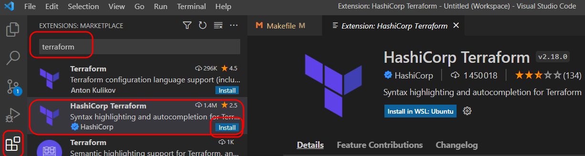
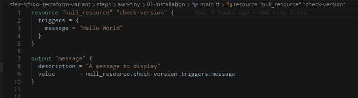
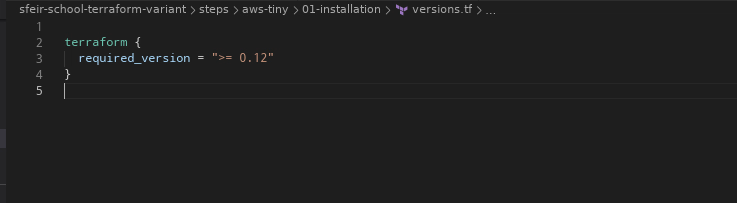

<!-- .slide: class="transition"-->

# Env de développement Terraform

##==##
<!-- .slide: -->

# Le choix de l'IDE
<br/>

Plusieurs IDE disponibles :  
* Intellij
* Atom
* Visual Studio Code (Notre choix)
* Sublime Text
* VIM

Notes:
- Le choix de l'IDE est primordial avant même de se lancer dans l'utilisation de Terraform car il offre un confort d'utilisation supérieur par rapport à un éditeur de texte classique.
- Les fonctionnalités proposées vont de la coloration syntaxique à la complétion automatique.
- Intellij (en version payante) propose des fonctionnalités très avancées.

##==##
<!-- .slide: class="exercice" -->

# Atelier - Installons tous les outils 1/2

<br/>

1. Installons AWS cli (V2)

    => [https://docs.aws.amazon.com/fr_fr/cli/latest/userguide/install-cliv2.html](https://docs.aws.amazon.com/fr_fr/cli/latest/userguide/install-cliv2.html)

##==##
<!-- .slide: class="exercice" -->

# Atelier - Installons tous les outils 2/2

<br/>

1. Installons notre IDE : <br>
    => [https://code.visualstudio.com/Download](https://code.visualstudio.com/Download)

2. Sur VisualStudio code, installons le plugin terraform:

    

##==##
<!-- .slide: class="exercice" -->

# Atelier - Regardons le code terraform avec votre IDE

<br>



<br>



##==##
<!-- .slide: class="exercice" -->

# Atelier - Installer et tester terraform-docs

1. Installez terraform-docs

    Choisissez la version et installez la dans le répertoire bin.

    https://github.com/terraform-docs/terraform-docs/releases/tag/v0.16.0

2. Testez-le sur le précédent exercice

    ```bash
    cd ../01-installation
    terraform-docs.exe markdown . > TF.md
    ```

    Consultez le fichier TF.md généré.
